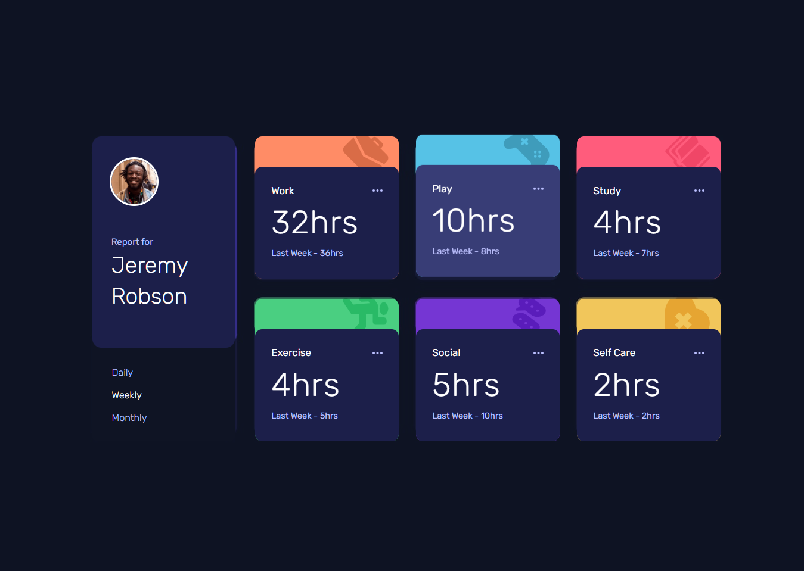

# Frontend Mentor - Time tracking dashboard solution

This is a solution to the [Time tracking dashboard challenge on Frontend Mentor](https://www.frontendmentor.io/challenges/time-tracking-dashboard-UIQ7167Jw). Frontend Mentor challenges help you improve your coding skills by building realistic projects. 

## Table of contents

- [Overview](#overview)
  - [The challenge](#the-challenge)
  - [Screenshot](#screenshot)
  - [Links](#links)
- [My process](#my-process)
  - [Built with](#built-with)
  - [What I learned](#what-i-learned)
  - [Continued development](#continued-development)
  - [Useful resources](#useful-resources)
  - [AI Collaboration](#ai-collaboration)
- [Author](#author)
- [Acknowledgments](#acknowledgments)

## Overview

### The challenge

Users should be able to:

- View the optimal layout for the site depending on their device's screen size
- See hover states for all interactive elements on the page
- Switch between viewing Daily, Weekly, and Monthly stats

### Screenshot



### Links

- Solution URL: (https://github.com/ParthaDey5/time-tracking-dashboard-main)
- Live Site URL: (https://time-tracking-dashboard-main-one.vercel.app)

## My process

### Built with

- Semantic HTML5 markup
- Tailwind CSS utility-first framework
- CSS custom properties (CSS variables)
- CSS Grid and Flexbox
- Mobile-first workflow
- Vanilla JavaScript (ES6+)
- BEM CSS methodology
- JSON data integration
- Async/await for data fetching

### What I learned

This project taught me several important concepts:

**JavaScript Array Methods and Data Handling**
- Learned to work with `reduce()` method for data aggregation
- Mastered dynamic property access with bracket notation
- Implemented async/await pattern for JSON data fetching
- Used `forEach()` for DOM manipulation and iteration

**CSS Architecture and Best Practices**
- Implemented CSS custom properties for maintainable color theming
- Applied BEM methodology for consistent naming conventions
- Used Tailwind CSS with custom utility classes
- Created responsive layouts with CSS Grid and Flexbox

**Advanced CSS Techniques**
- Custom cursor implementation using Tailwind configuration
- Background image positioning with arbitrary values
- Complex hover states and transitions
- Mobile-first responsive design patterns

**Code Organization and Best Practices**
- Function organization (helpers before main functions)
- Proper error handling with try-catch blocks
- Event delegation and DOM event management
- Semantic HTML structure for accessibility

```javascript
// Example of dynamic timeframe switching
function switchTimeframe(newTimeframe) {
  currentTimeframe = newTimeframe;
  
  // Update active button state
  document.querySelectorAll('.timeframe__btn').forEach(btn => {
    btn.classList.remove('timeframe__btn--active');
  });
  
  document.querySelector(`[data-timeframe="${newTimeframe}"]`)
    .classList.add('timeframe__btn--active');
  
  // Re-render with new data
  renderActivities();
}
```

```css
/* Custom cursor implementation */
.cursor-custom {
  cursor: url('/images/icons/cursor.png'), pointer;
}
```

### Continued development

Areas I want to focus on in future projects:

- **Advanced JavaScript Patterns**: Implement more complex state management patterns
- **Performance Optimization**: Learn lazy loading and code splitting techniques
- **Testing**: Add unit tests and integration tests for JavaScript functionality
- **Accessibility**: Deepen understanding of ARIA attributes and screen reader support
- **Animation**: Incorporate more sophisticated CSS animations and transitions
- **Build Tools**: Explore webpack and other modern build tool configurations

### Useful resources

- [Tailwind CSS Documentation](https://tailwindcss.com/docs) - Comprehensive utility-first framework guide
- [MDN Web Docs](https://developer.mozilla.org/) - Excellent reference for HTML, CSS, and JavaScript
- [CSS-Tricks](https://css-tricks.com/) - Great articles on CSS techniques and best practices
- [Frontend Mentor Community](https://www.frontendmentor.io/community) - Helpful feedback and inspiration
- [BEM Documentation](http://getbem.com/) - Clear guide to BEM methodology
- [JavaScript Info](https://javascript.info/) - Modern JavaScript tutorial with detailed explanations


## Author

- Frontend Mentor - [@ParthaDey5](https://www.frontendmentor.io/profile/ParthaDey5)

## Acknowledgments

Special thanks to the Frontend Mentor community for providing this challenging and educational project. The detailed design specifications and style guide made it possible to create a professional-looking dashboard that closely matches the original design.


